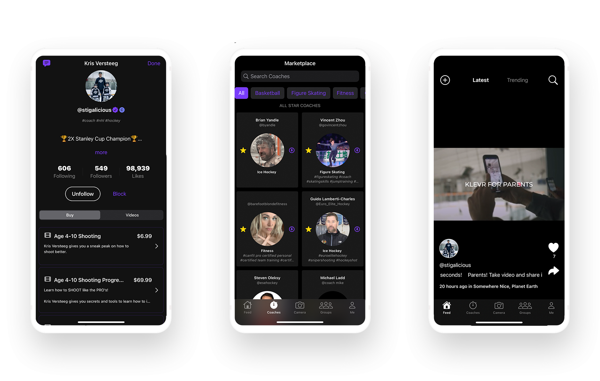
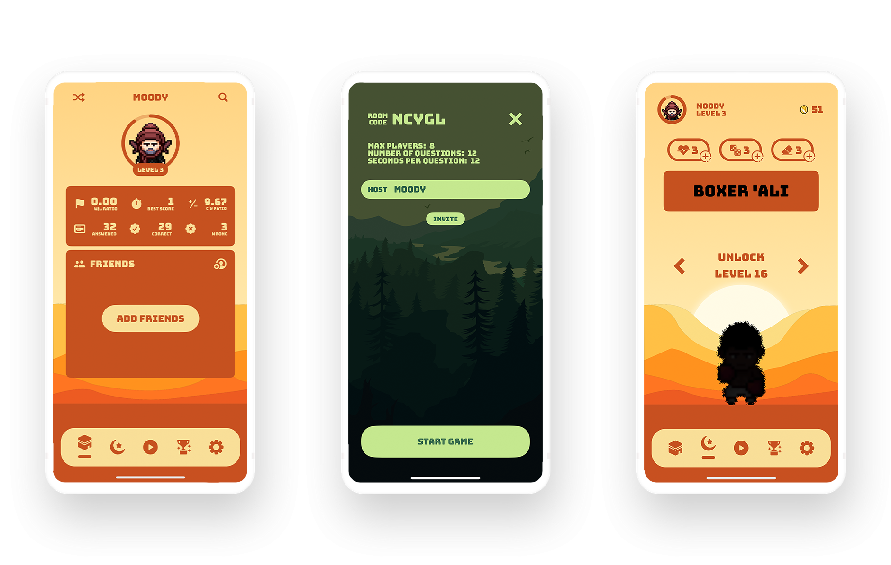

&nbsp;&nbsp;&nbsp;

## Klevr.ai
[Klevr.ai](https://klevr.ai) is an athletic platform that provides the tools for anyone to gain an edge with our growing community of Coaches, Parents, & Athletes who use Klevr to assist in the collective ability to play smarter, not harder. The iOS app lets the users show off their skills, purchase Grade A sport resources, chat with their coaches and more.

##### 🔨Technologies: SwiftUI, MVVM + Clean Architecture, UI + Unit Tests, CI, Push Notifications, Firebase SDK, REST API.
##### 🚀Platform: 📱iOS, iPad.

## DeenOD
[DeenOD](https://deenoverdunya.io) is an Islamic trivia game that is easy to master for those who have the 'Ilm. Answer the questions, score points, earn coins, buy heroes, and be amongst the top 4 players who know their deen.

##### 🔨Technologies: SwiftUI, Combine, MVVM, Notifications, GitHub, CoreData, TDD.
##### 🚀Platform: 📱iOS, iPad.

## Harry Potter
[Harry Potter](https://deenoverdunya.io) characters & spells on the go. Explore characters and spells from the series in detail. It's a user-friendly tool that provides comprehensive information, perfect for both casual fans and hardcore Potterheads.

##### 🔨Technologies: SwiftUI, Combine, MVVM, Protocols, Delegates, SwiftData, Unit Tests, TDD.
##### 🚀Platform: 📱iOS, iPad.

## ChatAI
[ChatAI](https://openai.com) Transform the way you communicate with ChatAI - the free iOS app that offers the ultimate conversational experience. Download now and discover the power of AI-driven conversations!

##### 🔨Technologies: SwiftUI, MVVM + Clean Architecture, UI + Unit Tests, RxSwift/Combine, Push Notifications, AWS Amplify.
##### 🚀Platform: 📱iOS, iPad.

*Do not hesitate to contact me if you would like to get a promo code to have a look at any of my indie apps.*
